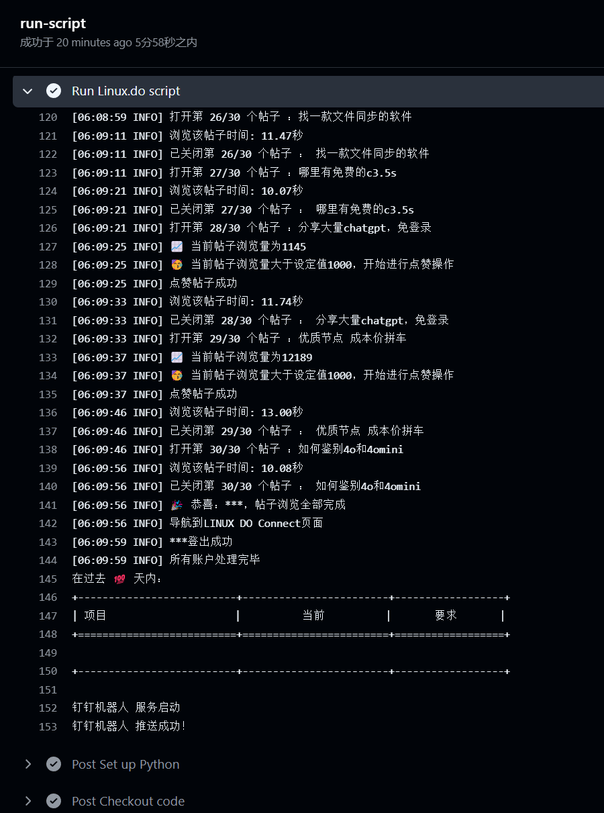

# Linux.do 自动浏览和点赞脚本

~~- 本脚本适用于浏览[LINUX DO](https://linux.do/)帖子和点赞，支持多账号~~

这个脚本用于自动浏览 [LINUX DO](https://linux.do/) 的帖子并进行点赞操作。它支持多账号，并可以在 GitHub Actions 或本地环境中运行。

## 功能特点

- 自动登录 Linux.do 账户
- 浏览帖子并模拟真实用户行为
- 根据设定的浏览量阈值进行点赞
- 支持多账号操作
- 提供运行结果的消息推送（支持多种推送方式）

### 使用教程
~~>测试环境 Python 3.10、selenium 4.23.1~~
~~1. 青龙面板安装Python依赖`selenium` Linux依赖`chromium`、`chromium-chromedriver`~~
~~2. 将Linux.do.py和notify.py放在青龙面板同一文件夹下~~
~~- 任务名：Linux.do浏览帖子~~
~~- 命令：task Linux.do.py~~
~~- 定时：0 7 * * *~~
~~>定时规则请自行修改~~
~~>不容易啊，全靠始皇的Shared~~

### 环境变量设置

#### 必需的环境变量（多账号换行）
```
export LINUXDO_USERNAME="neo@Linux.do
neo2@Linux.do"
export LINUXDO_PASSWORD="IamNeo!
IamNeo!"
```

#### 可选的环境变量
这些变量可以在 `Linux.do.py` 文件中找到并修改：
```
export SCROLL_DURATION=5 // 首页滚轮滚动时间，控制加载帖子数量，默认为0秒
export VIEW_COUNT=1000 // 点赞要求的帖子浏览量，默认大于1000浏览量才进行点赞
```

#### 消息推送相关的环境变量
这些变量可以在 `notify.py` 文件中找到并配置：
```
export DD_BOT_SECRET="your_dd_bot_secret" // 钉钉机器人密钥
export DD_BOT_TOKEN="your_dd_bot_token" // 钉钉机器人令牌
// 其他推送方式的环境变量...
```

### GitHub Actions（推荐）
**[点击查看运行截图](#运行截图)**
1. Fork 这个仓库到您的 GitHub 账户。

2. 在您的仓库中，进入 Settings > Secrets and variables > Actions，添加以下 secrets：

   - `LINUXDO_USERNAME`: Linux.do 用户名（多账号用换行分隔）
   - `LINUXDO_PASSWORD`: Linux.do 密码（多账号用换行分隔）
   - 其他可选的环境变量（如需要）

3. 脚本将按照 `.github/workflows/linuxdo_script.yml` 中定义的计划自动运行（默认每 8 小时一次）。

4. 您也可以在 Actions 页面手动触发工作流。

#### GitHub Actions 环境变量设置示例

以下是 `.github/workflows/linuxdo_script.yml` 文件中设置环境变量的示例：

```yaml
jobs:
  run-script:
    runs-on: ubuntu-latest
    steps:
      # ... 其他步骤 ...
      - name: Run Linux.do script
        env:
          # 必需的环境变量
          LINUXDO_USERNAME: ${{ secrets.LINUXDO_USERNAME }}
          LINUXDO_PASSWORD: ${{ secrets.LINUXDO_PASSWORD }}
          
          # 可选的环境变量示例
          SCROLL_DURATION: ${{ secrets.SCROLL_DURATION }}
          VIEW_COUNT: ${{ secrets.VIEW_COUNT }}
          
          # 消息推送环境变量示例
          DD_BOT_SECRET: ${{ secrets.DD_BOT_SECRET }}
          DD_BOT_TOKEN: ${{ secrets.DD_BOT_TOKEN }}
        run: |
          python Linux.do.py
```

在这个示例中，我们设置了必需的 `LINUXDO_USERNAME` 和 `LINUXDO_PASSWORD`，以及一些可选的环境变量。请确保在 GitHub 仓库的 Secrets 中添加了相应的值。


### 本地或服务器运行

1. 确保您的环境中安装了 Python 3.10 或更高版本。

2. 安装所需的依赖：
   ```
   pip install selenium requests
   ```

3. 安装 Chromium 和 ChromeDriver（如果使用 Linux 系统）：
   ```
   sudo apt-get install chromium chromium-chromedriver
   ```

4. 设置必需的环境变量（见上文）。

5. 运行脚本：
   ```
   python Linux.do.py
   ```

## 配置选项

- `SCROLL_DURATION`: 首页滚动持续时间（秒），控制加载的帖子数量，默认为 0
- `VIEW_COUNT`: 点赞所需的最小浏览量阈值，默认为 1000

## 消息推送

脚本支持多种消息推送方式，包括钉钉机器人、飞书、ServerChan 等。您可以在 `notify.py` 文件中配置所需的推送方式。

## 注意事项

- 请遵守 Linux.do 的使用条款和规则。
- 不要将您的账户凭据直接硬编码在脚本中。
- 适当调整运行频率，避免对网站造成不必要的负担。

## 贡献

欢迎提交 Issues 或 Pull Requests 来改进这个项目。

## 免责声明

本脚本仅用于学习和研究目的。使用本脚本所产生的任何后果由用户自行承担。

- 示例图


---
### 运行截图

